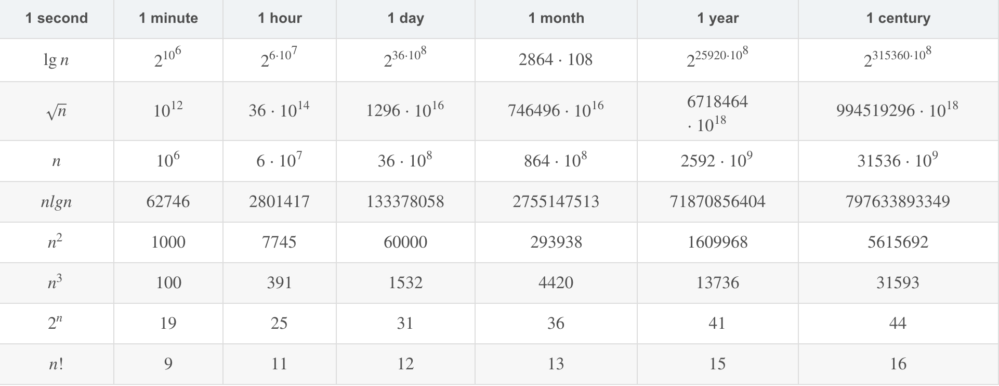

## 什么是算法

**算法**就是任何定义良好的计算过程，这个过程取某个值或者一组值作为**输入**并产生某个值或者值的集合作为**输出**,即算法就是一系列的计算步骤，用来将输入数据转换成输出结果。

### 作用

对于某一个问题来说，可能有许多解决他的正确方法，不同的算法效率不一样，效率差距的影响往往比硬件和软件方面的差距还要大，计算时间，存储空间等等都是有限的资源，这些有限的资源必须被有效的利用，此时那些时间和空间上有效的算法就有助于做到这一点。

随着计算机性能不断地增长，可以利用计算机来解决比以往更大的问题，也正是因为问题更大，不同的算法在效率方面的差异会更加巨大。

**效率**

书上举了一个例子，来说明算法效率的差距在面对大规模问题时的巨大差异。

插入排序时间复杂度：N^2

归并排序时间复杂度：NlogN

假设有AB两台计算机，每台计算机需要完成的任务是对1000W个数字排序（8字节的整数，输入占用80mb).

假设A计算机每秒执行百亿条指令，B计算机每秒仅能执行1000W条指令，纯硬件计算能力来说A计算机是B的1000倍。

假设世界上最巧妙地程序员为计算机A编码插入排序，为了排序N个数字，代码需要执行`2N^2`条指令。

假设以为水平一般的程序员为计算机B编写归并排序，为了排序N个数字，代码需要执行`50NlogN`条指令。

为了排序1000W个数字，计算机A需要 `(2*1000W)^2/100亿指令每秒 = 20000秒 = 5.5个小时`

为了排序1000W个数字，计算机B需要 `50*1000W**log1000W / 1000W条指令每秒 = 1163秒 < 20分钟`

在硬件差距如此巨大的情况下，计算机B比计算机A还要快17倍。如果排序的数字是一亿个，归并排序不超过四个小时，插入排序需要23天！规模越大，归并排序的优势越大。

**算法能解决哪些问题不能解决哪些问题**

**什么是 NP 完全问题？Leetcode 上面几个 NP 完全问题**

**思考题**

> 假设求解问题的算法需要f(n)微妙，对下表中的每个函数和时间t,确定可以在时间t内求解的问题的最大规模n



**补充**

**插入排序**

```java
public static void insertSort(int[] arr){
        for (int i = 1; i < arr.length ; i++) {
            int num = arr[i];
            int j = i - 1;
            while(j >=0 && arr[j] > num){
                arr[j+1] = arr[j];
                j --;
            }
            // arr[j+1] = arr[j]; 使j往后移了一位，j--，所以j+1就是要插入的位置
            arr[j+1] = num;
        }
    }
```

**归并排序**

```java
    static int[] temp;    
 public static void mergeSort(int[] arr){
        temp = new int[arr.length];
        mergeSort(arr, 0, arr.length - 1);
    }
    public static void mergeSort(int[] arr, int left, int right){
        if (left >= right) return;
        int mid = (left + right) / 2;
        mergeSort(arr, left, mid);
        mergeSort(arr, mid + 1, right);
        merge(arr, left, mid, right);
    }

    private static void merge(final int[] arr, final int left, final int mid, final int right) {
        int i = left;
        int j = mid + 1;
        int k = 0;
        while (i <= mid && j <= right) {
            if (arr[i] <= arr[j]) {
                temp[k++] = arr[i++];
            }else {
                temp[k++] = arr[j++];
            }
        }
        while (i <= mid) {
            temp[k++] = arr[i++];
        }
        while (j <= right) {
            temp[k++] = arr[j++];
        }
        int index = 0;
        for (int l = left; l <= right ; l++) {
            arr[l] = temp[index++];
        }
    }
```

**冒泡排序**

```java
    public static void bubbleSort(int[] arr){
        for (int i = 0; i < arr.length ; i++) {
            boolean exchange = false;
            for (int j = arr.length-1; j >= i + 1 ; j--) {
                if (arr[j] < arr[j-1]){
                    exchange = true;
                    int temp = arr[j];
                    arr[j] = arr[j-1];
                    arr[j-1] = temp;
                }
            }
            if (!exchange) break;
        }

    }
```

